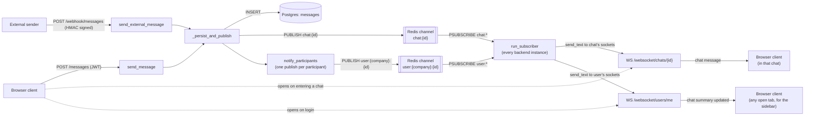

# Architecture: message data flow

Two entry points — an authenticated client sending a message over REST, and an
external system delivering one over the signed webhook — converge into the
same persistence and fan-out path. From there, two independent Redis pub/sub
channels carry updates out to connected clients: one per chat (chat
messages), one per user (cross-chat activity, e.g. the chat
list). See [ADR-0001](adr/0001-containerized-websocket-over-api-gateway.md)
for why WebSocket termination lives in the backend container rather than API
Gateway, and [ADR-0003](adr/0003-redis-pubsub-for-horizontal-scaling.md) for
why Redis pub/sub exists at all — it's what lets a message published on one
backend instance reach a client connected to a different instance.

## Notes

- **Two entry points, one path.** A REST message from a logged-in user
  (`POST /messages`) and a webhook message from an external system
  (`POST /webhook/messages`, HMAC-verified) both call into
  `_persist_and_publish` — same INSERT, same publish fan-out. The only
  difference is `sender_type` (`user` vs `external`) and how the caller is
  authenticated.
- **Two independent channels, not one.** `chat:{id}` carries the
  actual message body to clients with that chat's WebSocket open.
  `user:{company_id}:{user_id}` carries a lighter "this chat changed" summary to every
  participant, independent of which chat (if any) they currently have
  open — this is what keeps the chat list's last-message preview live
  without every client subscribing to every chat it's part of.
- **The subscriber runs per instance.** Every backend instance holds its own
  in-memory `ConnectionManager` (which sockets are open, keyed by
  `chat_id` and by `user_id`) and its own Redis subscriber. A message
  published by the instance that received the HTTP request still reaches a
  client connected to a different instance, because delivery goes through
  Redis, not directly from the publishing instance's connection map.
- **Auth on the WebSocket handshake.** Both WS endpoints take the JWT as a
  `token` query param (not a header) and decode it before accepting the
  connection — a WebSocket handshake can't carry a custom `Authorization`
  header from the browser. See
  [ADR-0004](adr/0004-jwt-in-localstorage.md) for why the token lives in
  `localStorage` in the first place.
