# Architecture: message data flow

Two entry points — an authenticated client sending a message over REST, and an
external system delivering one over the signed webhook — converge into the
same persistence path. Neither of them publishes: the request writes an
**outbox row** in the same transaction as the message, and a separate **drain
process** publishes it afterwards. From there, three Redis addresses carry
updates out to connected clients — one per chat, one for that chat's staff
only, and one per user (cross-chat activity, e.g. the chat list). See
[ADR-0001](adr/0001-containerized-websocket-over-api-gateway.md)
for why WebSocket termination lives in the backend container rather than API
Gateway, and [ADR-0003](adr/0003-redis-pubsub-for-horizontal-scaling.md) for
why Redis pub/sub exists at all — it's what lets a message published on one
backend instance reach a client connected to a different instance.

```mermaid
flowchart LR
    Client["Browser client"]
    External["External sender"]

    Client -->|"POST /messages (JWT)"| SendMsg["send_message"]
    External -->|"POST /webhook/messages (HMAC signed)"| SendExt["send_external_message"]

    SendMsg --> Persist["_persist_and_announce"]
    SendExt --> Persist

    Persist -->|"INSERT (one transaction)"| PG[("Postgres: messages + outbox")]

    PG -->|"SELECT WHERE published_at IS NULL"| Drain["drain_once\n(separate drain process, in a loop)"]
    Drain -->|"PUBLISH, then mark published"| ChatChannel[["chat:{company}:{chat}"]]
    Drain --> StaffChannel[["chat:{company}:{chat}:staff"]]
    Drain --> UserChannel[["user:{company}:{user}"]]

    ChatChannel -->|"PSUBSCRIBE chat:*"| Sub["run_subscriber\n(every backend instance)"]
    StaffChannel -->|"PSUBSCRIBE chat:*"| Sub
    UserChannel -->|"PSUBSCRIBE user:*"| Sub

    Sub -->|"send_text to that address's sockets"| ChatWS["WS /websocket/chats/{id}"]
    Sub -->|"send_text to that address's sockets"| UserWS["WS /websocket/users/me"]

    ChatWS -->|"chat message"| ClientA["Browser client\n(in that chat)"]
    ChatWS -->|"staff-only message\n(staff sockets only)"| ClientS["Browser client\n(Company staff in that chat)"]
    UserWS -->|"chat summary updated"| ClientB["Browser client\n(any open tab, for the sidebar)"]

    Client -.->|"opens on entering a chat"| ChatWS
    Client -.->|"opens on login"| UserWS
```

## Notes

- **Two entry points, one path.** A REST message from a logged-in user
  (`POST /messages`) and a webhook message from an external system
  (`POST /webhook/messages`, HMAC-verified) both call into
  `_persist_and_announce` — same INSERT, same outbox rows. The only
  difference is `sender_type` (`user` vs `external`) and how the caller is
  authenticated.
- **The request writes, the drain publishes.** The outbox row lands in the same
  transaction as the message it announces, so a rollback takes the announcement
  with it and nobody is told about a message the database no longer holds. The
  drain publishes a row and only then marks it, so a crash in between costs a
  duplicate frame rather than a lost one. The age of the oldest unpublished row
  is the realtime health signal.
- **Three addresses, not two.** `chat:{company}:{chat}` carries the message body
  to everyone in the chat; `chat:{company}:{chat}:staff` carries a **Staff-only
  Message** to the Company's staff and to nobody else; `user:{company}:{user}`
  carries a lighter "this chat changed" summary to every participant,
  independent of which chat (if any) they currently have open — this is what
  keeps the chat list's last-message preview live without every client
  subscribing to every chat it's part of.
- **Isolation comes from the address.** Nothing on the delivery path reads a
  rule. A socket joins the addresses its holder is entitled to at the handshake,
  decided by the same predicate the API asks; after that the subscriber routes
  by channel name. An end client's socket never joined the staff address, so
  there is no filter to forget.
- **The subscriber runs per instance.** Every backend instance holds its own
  in-memory `ConnectionManager` (which sockets are open, keyed by address) and
  its own Redis subscriber. A message published by the drain still reaches a
  client connected to any instance, because delivery goes through Redis rather
  than any one process's connection map.
- **Auth on the WebSocket handshake.** Both WS endpoints take the JWT as a
  `token` query param (not a header) and decode it before accepting the
  connection — a WebSocket handshake can't carry a custom `Authorization`
  header from the browser. See
  [ADR-0004](adr/0004-jwt-in-localstorage.md) for why the token lives in
  `localStorage` in the first place.
