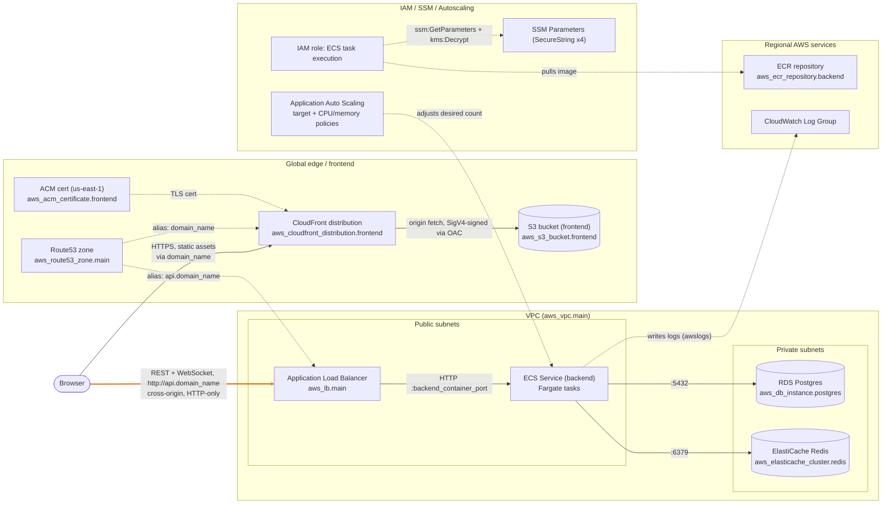

# AWS architecture (rendered)

Mermaid rendering of [`docs/aws-diagram-spec.md`](aws-diagram-spec.md), which
remains the authoritative written spec for hand-drawing this in DrawIO. Nodes
and edges here are a direct translation of that spec's Components and
Connections tables. Everything is real (backed by `infra/*.tf`) — the
highlighted orange edge isn't hypothetical, it's the one connection with a
known gap (mixed content: HTTPS frontend calling an HTTP-only API).

